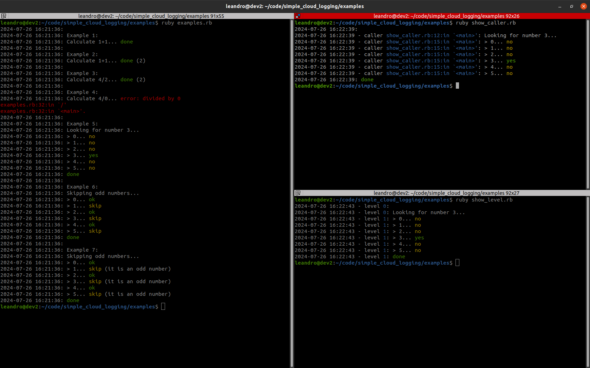

 

# Simple Cloud Logging

**Simple** and **Colorful** logging library for Ruby, with the following features:

- :heavy_check_mark: Colorization,
- :heavy_check_mark: Log Size Control,
- :heavy_check_mark: Nesting Debug Information,
- :heavy_check_mark: Nesting Assertions; and
- :heavy_check_mark: Dummy Logger Facade.




**Outline**

1. [Installation](#1-installation)
2. [Getting Started](#2-getting-started)
3. [Closing Lines with Details](#3-closing-lines-with-details)
4. [Starting and Closing in One Line](#4-starting-and-closing-in-one-line)
5. [Writing Blank Lines](#5-writing-blank-lines)
6. [Writing Errors](#6-writing-errors)
7. [Abbreviations](#7-abbreviations)
8. [Skipping With Details](#8-skipping-with-details)
9. [Custom Line Closing](#9-custom-line-closing)
10. [Custom Line Closing](#10-custom-line-closing)
11. [Nesting Lines](#11-nesting-lines)
12. [Nesting Assertions](#12-nesting-assertions)
13. [Size Control](#13-size-control)
14. [Disabling Colorization](#14-disabling-colorization)
15. [Showing Nesting Level](#15-showing-nesting-level)
16. [Showing Callers](#16-showing-callers)
17. [Dummy Loggers](#17-dummy-loggers)
18. [Versioning](#18-versioning)
19. [Authors](#19-authors)
20. [License](#20-license)

## 1. Installation

```
gem install simple_cloud_logging
```

## 2. Getting Started

Start an close a log line.

```ruby
require 'simple_cloud_logging'

l = BlackStack::LocalLogger.new("examples.log")

l.logs "Calculate 1+1... "
n = 1 + 1
l.done
```

```
2024-07-26 15:27:04: Calculate 1+1... done
```

## 3. Closing Lines with Details

```ruby
l.logs "Calculate 1+1... "
n = 1 + 1
l.done(details: n)
```

```
2024-07-26 15:27:04: Calculate 1+1... done (2)
```

## 4. Starting and Closing in One Line

```ruby
require 'simple_cloud_logging'

l = BlackStack::LocalLogger.new("examples.log")

l.log "Example 1:"
l.logs "Calculate 1+1... "
n = 1 + 1
l.done
```

```
2024-07-26 15:27:04: Example 1:
2024-07-26 15:27:04: Calculate 1+1... done
```

## 5. Writing Blank Lines

```ruby
require 'simple_cloud_logging'

l = BlackStack::LocalLogger.new("examples.log")

l.blank_line
l.logs "Calculate 1+1... "
n = 1 + 1
l.done
```

```
2024-07-26 15:27:04: 
2024-07-26 15:27:04: Calculate 1+1... done
```

## 6. Writing Errors

```ruby
l.logs "Calculate 4/0... "
begin
    n = 4/0
    l.done(details: n)
rescue => e
    l.error(e)
end
```

```
2024-07-26 15:27:04: Calculate 4/0... error: divided by 0
examples.rb:32:in `/'
examples.rb:32:in `<main>'.
```

## 7. Abbreviations

You can close a line with other `yes` or `no`.

```ruby
i = 0
while i < 6
    l.logs "Is #{i}==3?... "
    if i == 3
        l.yes
    else
        l.no
    end
    i += 1
end
```

You can close a line with other `ok` or `skip` too.


```ruby
i = 0
while i < 6
    l.logs "Only even numbers: #{i}... "
    if i % 2 == 0
        l.ok
    else
        l.skip
    end
    i += 1
end
```

## 8. Skipping With Details

```ruby
i = 0
while i < 6
    l.logs "#{i}... "
    if i % 2 == 0
        l.ok
    else
        l.skip(details: 'it is an odd number')
    end
    i += 1
end
```

## 9. Custom Line Closing

As you can read above, you can start a log line with the `logs` method, and you can close it with any of the methopds `done`, `error`, `yes`, `no`, `ok` and `skip`.

Each method is printed with its own color:

- `done`: green.
- `error`: red.
- `yes`: green.
- `no`: yellow.
- `ok`: green.
- `skip`: yellow.

## 10. Custom Line Closing

If you need to close a line with a specitic text, you can use the `logf` method.

You can also add color to your custom text.

```ruby
i = 0
while i < 6
    l.logs "#{i}... "
    if i % 2 == 0
        l.ok
    else
        l.logf("rejected".blue)
    end
    i += 1
end
```

## 11. Nesting Lines

```ruby
l.logs "Skipping odd numbers... "
i = 0
while i < 6
    l.logs "#{i}... "
    if i % 2 == 0
        l.ok
    else
        l.skip(details: 'it is an odd number')
    end
    i += 1
end
l.done
```

```
2024-07-26 15:27:04: Skipping odd numbers... 
2024-07-26 15:27:04: > 0... ok
2024-07-26 15:27:04: > 1... skip (it is an odd number)
2024-07-26 15:27:04: > 2... ok
2024-07-26 15:27:04: > 3... skip (it is an odd number)
2024-07-26 15:27:04: > 4... ok
2024-07-26 15:27:04: > 5... skip (it is an odd number)
2024-07-26 15:27:04: done
```

## 12. Nesting Assertions

You can setup **simple_cloud_loggin** to check if you are nesting your log correctly.

```ruby
BlackStack::Logger.set(
    nesting_assertion: true,
)
```

Below I wrote 4 diffent examples of wrong nestung usage, and the output of each one.

**Example 1:**

```ruby
begin
    l.blank_line
    l.logs "Looking for number 3... "
    i = 0
    while i < 6
        l.logs "#{i}... "
        if i == 3
            #l.yes # --> I missed to close the log line !
        else
            l.no
        end
        i += 1
    end
    l.done
rescue => e
    l.error(e)
end
```

```
2024-07-26 15:58:43: 
2024-07-26 15:58:43: Looking for number 3... 
2024-07-26 15:58:43: > 0... no
2024-07-26 15:58:43: > 1... no
2024-07-26 15:58:43: > 2... no
2024-07-26 15:58:43: > 3... error: Log nesting assertion: You missed to close the log-level that you opened at assertion1.rb:15:in `<main>'.
/home/leandro/code/simple_cloud_logging/lib/baselogger.rb:150:in `logs'
/home/leandro/code/simple_cloud_logging/lib/locallogger.rb:46:in `logs'
assertion1.rb:15:in `<main>'.
```

**Example 2:**

```ruby
begin
    l.blank_line
    l.logs "Looking for number 3... "
    i = 0
    while i < 6
        #l.logs "#{i}... " # --> I missed to open the log.
        if i == 3
            l.yes 
        else
            l.no 
        end
        i += 1
    end
    l.done
rescue => e
    l.error(e)
end
```

```
2024-07-26 15:59:44: 
2024-07-26 15:59:44: Looking for number 3... no
error: Log nesting assertion: You are closing 2 times the level started, or you missed to open that lavel, or you closed the another level in the middle 2 times.
/home/leandro/code/simple_cloud_logging/lib/baselogger.rb:218:in `logf'
/home/leandro/code/simple_cloud_logging/lib/locallogger.rb:53:in `logf'
/home/leandro/code/simple_cloud_logging/lib/baselogger.rb:261:in `no'
assertion2.rb:19:in `<main>'.
```

**Example 3:**

```ruby
begin
    l.blank_line
    #l.logs "Looking for number 3... " # --> I missed to open the log.
    i = 0
    while i < 6
        l.logs "#{i}... " 
        if i == 3
            l.yes 
        else
            l.no 
        end
        i += 1
    end
    l.done
rescue => e
    l.error(e)
end
```

```
2024-07-26 16:00:41: 
2024-07-26 16:00:41: 0... no
2024-07-26 16:00:41: 1... no
2024-07-26 16:00:41: 2... no
2024-07-26 16:00:41: 3... yes
2024-07-26 16:00:41: 4... no
2024-07-26 16:00:41: 5... no
error: Log nesting assertion: You are closing 2 times the level started, or you missed to open that lavel, or you closed the another level in the middle 2 times.
/home/leandro/code/simple_cloud_logging/lib/baselogger.rb:218:in `logf'
/home/leandro/code/simple_cloud_logging/lib/locallogger.rb:53:in `logf'
/home/leandro/code/simple_cloud_logging/lib/baselogger.rb:233:in `done'
assertion3.rb:23:in `<main>'.
```

**Example 4:**

```ruby
begin
    l.blank_line
    l.logs "Looking for number 3... "
    i = 0
    while i < 6
        l.logs "#{i}... " 
        if i == 3
            l.yes 
            l.no # --> I closed the same level 2 times by mistake
        else
            l.no 
        end
        i += 1
    end
    l.done
rescue => e
    l.error(e)
end
```

```
2024-07-26 16:01:23: 
2024-07-26 16:01:23: Looking for number 3... 
2024-07-26 16:01:23: > 0... no
2024-07-26 16:01:23: > 1... no
2024-07-26 16:01:23: > 2... no
2024-07-26 16:01:23: > 3... yes
2024-07-26 16:01:23: no
2024-07-26 16:01:23: 4... no
2024-07-26 16:01:23: 5... no
error: Log nesting assertion: You are closing 2 times the level started, or you missed to open that lavel, or you closed the another level in the middle 2 times.
/home/leandro/code/simple_cloud_logging/lib/baselogger.rb:218:in `logf'
/home/leandro/code/simple_cloud_logging/lib/locallogger.rb:53:in `logf'
/home/leandro/code/simple_cloud_logging/lib/baselogger.rb:233:in `done'
assertion4.rb:24:in `<main>'.
```

## 13. Size Control

```ruby
BlackStack::Logger.set(
    min_size: 6*1024, # 6KB bytes
    max_size: 10*1024 # 10KB bytes
)
```

Each time the logfile grows over `max_size` bytes, it will be dropbed to `min_size` bytes.

The dropping is made by dropping the head lines. The tail is preserved.

## 14. Disabling Colorization

```ruby
BlackStack::Logger.set(
    colorize: false,
)
```

Disabling colorization gets **simple_cloud_logging** overwritting the instance methods `green`, `red`, `blue` and `yellow` of the class `String` to make them non-effect.

If you require the `colorize` gem after the logger setup, colors will be activated again.

## 15. Showing Nesting Level

If you are working with nested logs, you can show the nesting level of the current line.

This feature is useful if you want to visualize where you open and close each loggin line.

```ruby
BlackStack::Logger.set(
    show_nesting_level: true,
)
```

```
2024-07-26 16:07:43 - level 0: 
2024-07-26 16:07:43 - level 0: Looking for number 3... 
2024-07-26 16:07:43 - level 1: > 0... no
2024-07-26 16:07:43 - level 1: > 1... no
2024-07-26 16:07:43 - level 1: > 2... no
2024-07-26 16:07:43 - level 1: > 3... yes
2024-07-26 16:07:43 - level 1: > 4... no
2024-07-26 16:07:43 - level 1: > 5... no
2024-07-26 16:07:43 - level 1: done
```

## 16. Showing Callers

You can show from which like in your souce code you opened each log line.

This feature is useful if you want to visualize and fix nesting errors.

```ruby
BlackStack::Logger.set(
    show_nesting_caller: true,
)
```

```
2024-07-26 16:10:59 - caller show_caller.rb:12:in `<main>': Looking for number 3... 
2024-07-26 16:10:59 - caller show_caller.rb:15:in `<main>': > 0... no
2024-07-26 16:10:59 - caller show_caller.rb:15:in `<main>': > 1... no
2024-07-26 16:10:59 - caller show_caller.rb:15:in `<main>': > 2... no
2024-07-26 16:10:59 - caller show_caller.rb:15:in `<main>': > 3... yes
2024-07-26 16:10:59 - caller show_caller.rb:15:in `<main>': > 4... no
2024-07-26 16:10:59 - caller show_caller.rb:15:in `<main>': > 5... no
2024-07-26 16:10:59: done
```

## 17. Dummy Loggers

The methods of the `DummyLogger` class just do nothing.

You can choose between `LocalLogger` or `DummyLogger` depending if you want to write log or not, dynamically.

`DummyLogger` is useful to pass or not a logger to a function, for deep-nested logging.

**Example:** 

```ruby
class FooClass
    attr_accessor :logger

    def initialize(the_logger=nil)
        self.logger=the_logger
        self.logger = BlackStack::DummyLogger.new(nil) if self.logger.nil? # assign a dummy logger that just generate output on the screen
    end

    def do_something()
      self.logger.logs 'This log line will show up in the console only if the logger is not a DummyLogger instance...'
      # do something here
      self.logger.done
    end
end # class FooClass
```

## 18. Versioning

We use [SemVer](http://semver.org/) for versioning. For the versions available, see the last [ruby gem](https://rubygems.org/gems/simple_command_line_parser). 

## 19. Authors

* **Leandro Daniel Sardi** - *Initial work* - [LeandroSardi](https://github.com/leandrosardi)

## 20. License

This project is licensed under the MIT License - see the [LICENSE.md](LICENSE.md) file for details.

